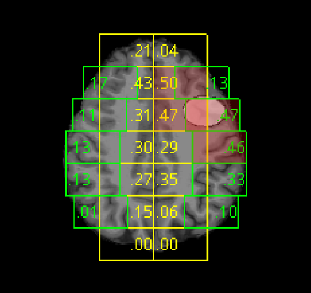

# CNNS for FCD detection 
This is the source code for paper "Convolutional neural networks for automatic detection of focal cortical dysplasia".

## Motivation 

We apply deep learning based methods for the task of automatic detection of FCD. 

## Dependencies 

```angular2
python >= 3.6
pytorch >= 1.3.0
numpy >= 1.14.0
numba >= 0.43.0
nibabel >= 3.0.2
torchio >= 0.17.0
```
Also, for preprocessing you will need [FreeSurfer](https://surfer.nmr.mgh.harvard.edu/) software.

## Training 

Put labeled FCD subjects images into folder `data/fcd_brains/`. Put masks for them into folder `data/masks/`. 
Put control subjects MRI images into folder `data/control_brains/`.

All MRI images should be in `.nii.gz` format.

And then simply run shell script with recommended parameters:

```angular2
./train_script.sh
```

In `parameter.py` all tunable parameters are listed. 
## Examples 

Green is side patches. Yellow is middle patches. White is FCD ellipse mask. 


## Aknowledgements

Project medical partner: science-practical [center n.a. Pirogov](http://www.pirogov-center.ru/english/about/) for annotated test data. 
We acknowledge Zhores HPC for the computation facilities.


